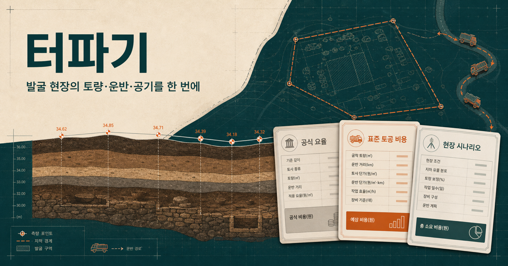
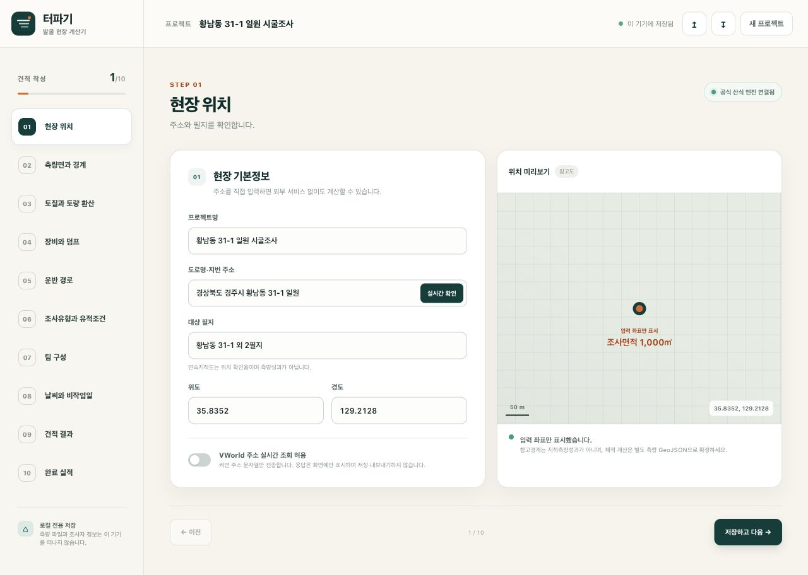
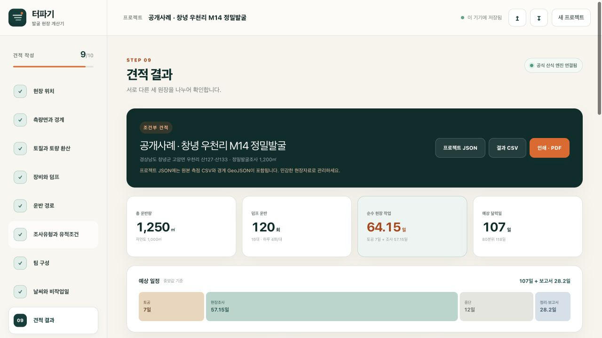
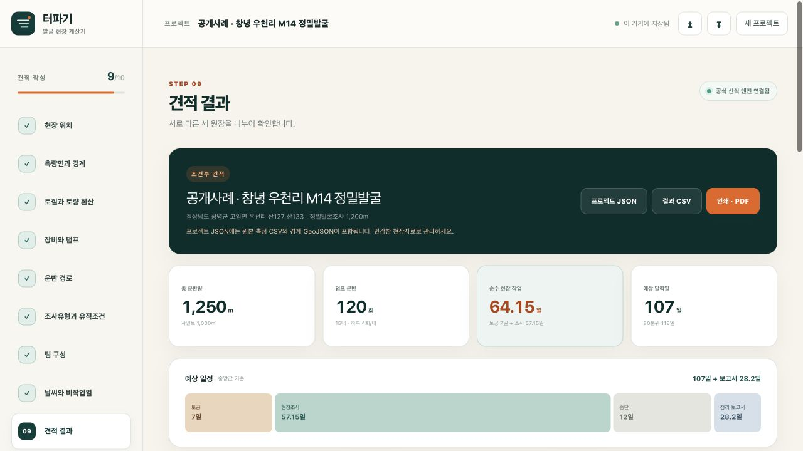

<p align="center">
  
</p>

<h1 align="center">터파기</h1>

<p align="center">
  <strong>측량면에서 덤프 회전수까지, 공식 대가에서 “우리 팀이라면 며칠?”까지.</strong><br />
  한국 매장유산 발굴 현장을 위한 로컬 우선 토공·공기·단가 추정기
</p>

<p align="center">
  <a href="https://github.com/lzpxilfe/price-excavation/actions/workflows/ci.yml"></a>
  <a href="./LICENSE"></a>
  
  
</p>

<p align="center">
  <a href="#빠른-시작">빠른 시작</a> ·
  <a href="#화면-미리보기">화면</a> ·
  <a href="#공개자료-실증-어디까지-계산할-수-있나">공개자료 실증</a> ·
  <a href="#측량-입력-계약">입력 계약</a> ·
  <a href="#참조자료-버전과-업데이트">자료 갱신</a>
</p>

필지의 위치와 측량면, 토질, 장비, 운반 경로, 조사 조건, 팀 구성, 날씨를 한 흐름에서 검토하는 브라우저 기반 개념견적 도구입니다. 적치토의 자연상태 체적을 구해 흐트러진 토량으로 환산하고, 덤프트럭 적재 횟수·배차기간을 설명 가능한 산식으로 계산합니다. 이어 국가유산청 「매장유산 조사용역 대가의 기준」에 따른 조사인력·경비, 현장 달력일, 완료실적 기반 팀·개인 보정을 서로 섞지 않고 보여 줍니다.

이 저장소는 국가유산청이나 다른 공공기관이 개발·승인·보증한 공식 서비스가 아닙니다. 결과는 초기 계획과 대안 비교를 위한 참고값이며 공인 측량성과, 설계수량, 계약금액, 차량 운행허가 또는 공식 조사대가 계산 결과를 대신하지 않습니다.

현행 구조화 자료 기준일은 **2026-08-10**입니다. 2026년 상반기 보통인부 단가는 2026-08-31까지 적용되는 자료이므로, 그 뒤 착수하는 견적은 새 단가세트가 게시되었는지 먼저 확인해야 합니다.

## v1이 다루는 범위

화면은 다음 10단계로 구성됩니다.

1. 주소·지번·좌표로 현장 위치 기록
2. 상부면·기준면 CSV와 계산 경계 GeoJSON 또는 수동 체적 입력
3. 자연·흐트러짐·다짐 상태와 토량환산계수 `L`, `C`, 습윤밀도 입력
4. 굴삭기 생산량과 덤프트럭 중량·용적 한계 입력
5. 사토장까지의 적재주행·공차복귀·대기·세륜 등 운반 사이클 확인
6. 시굴·정밀발굴 조사 조건 입력
7. 역할별 인원·참여인일·일단가와 팀 실적 보정 관리
8. 착수일·기상 참고기준·대기요율 검토
9. 공식 대가기준, 표준 토공원가, 현장 시나리오를 분리해 확인·내보내기
10. 완료 실적을 기록해 이후 견적의 보정 근거로 사용

v1은 한 현장, 한 계산 경계, 한 토질 배치, 한 굴삭기 규격, 한 덤프트럭 규격과 한 사토장 왕복경로를 전제로 합니다. 점군·정사영상 자체 처리, 드론 사진측량, 법적 필지경계 확정, 다층 토질, 여러 중간 적치장, 실시간 차량관제, 대형차 전용 경로탐색, 운행허가 판정, 오염토·폐기물 인허가, 계약내역서 자동작성은 범위 밖입니다.

주소나 연속지적도만으로는 3차원 체적을 알 수 없습니다. 주소·필지는 위치와 참조경계를 찾는 보조수단이고, 체적 확정에는 같은 수직기준을 사용한 상부·기준 표고 또는 사용자가 확인한 수동 체적이 필요합니다.

## 빠른 시작

Node.js 22.13.0 이상이 필요합니다.

```bash
git clone https://github.com/lzpxilfe/price-excavation.git
cd price-excavation
cp .env.example .env.local
npm ci
npm run dev
```

기본 개발 주소는 `http://localhost:3000`입니다. 외부 조회 없이도 주소, 체적, 거리, 시간, 기상 비작업일을 직접 입력해 전체 계산 흐름을 사용할 수 있습니다.

주요 명령은 다음과 같습니다.

```bash
npm run dev            # 로컬 개발 서버
npm run build          # 배포 빌드
npm run lint           # ESLint
npm run typecheck      # 앱과 core 타입 검사
npm run validate:data  # 버전·상태·출처 참조 데이터 검사
npm run public:cases   # 공개 계획·허가 사례의 재현 가능한 비교표 출력
npm run test:public    # 공개사례 스냅샷·가정·저장정책 회귀검증
npm run check:sources  # 법령정보 API로 현행 고시 변경 후보 확인(자동 적용 안 함)
npm test               # core/data/build/render 테스트
npm run check          # lint + typecheck + 전체 테스트
```

GitHub Actions는 `npm ci`, `npm run lint`, `npm run typecheck`, `npm test`를 실행합니다. 프로젝트와 실적은 IndexedDB에 저장하며 서버 데이터베이스나 계정은 사용하지 않습니다.

## 화면 미리보기

기본 프로젝트에는 합성 측량·토공 가정이 들어 있어 API 키 없이 10단계를 둘러볼 수 있습니다. 아래 이미지는 이 저장소의 앱을 로컬에서 직접 실행해 캡처한 화면입니다.

<p align="center">
  
</p>

<p align="center"><sub>현장 위치 · 주소는 수동 입력만으로 사용할 수 있고 측량자료는 외부 API로 보내지 않습니다.</sub></p>

공개된 창녕 우천리 사례의 조사유형·면적·팀 민감도 값을 실제 화면에 입력해 결과와 세 원장도 확인했습니다. 토공 1,000㎥와 운반 조건은 공개문서에 없으므로 앱의 예시 가정이며, 공개사례 검증값으로 취급하지 않습니다.

<table>
  <tr>
    <td width="50%"></td>
    <td width="50%"></td>
  </tr>
  <tr>
    <td align="center"><sub>보통인부 2명 가정: 조사 57.15일</sub></td>
    <td align="center"><sub>공식 대가·표준 토공·현장 시나리오를 합산하지 않고 분리</sub></td>
  </tr>
</table>

## 공개자료 실증: 어디까지 계산할 수 있나

결론부터 말하면 **공식 대가와 과거기상 시나리오는 공개자료로 상당 부분 계산할 수 있고, 공기는 계획·허가 기준선까지 비교할 수 있습니다.** 반면 적치토 체적, 특정 차량의 적재량, 실제 임대료, 역할별 실작업일과 팀 생산성은 현장 측량·차량서류·계약값·일지가 없으면 확정할 수 없습니다.

실증은 서로 다른 세 증거수준을 섞지 않습니다.

1. **정확식 검증:** 국가유산청 고시와 공식 계산기의 고정 조건을 원 단위로 회귀검증
2. **공개 계획 교차검토:** 나라장터 과업지시서의 계획 면적·기간·예산에 명시적 가정 시나리오를 대조
3. **공개 완료자료 비교:** 발굴허가대장의 기간을 낮은 신뢰도 익명 기준선으로만 사용

재현 명령은 네트워크를 호출하지 않습니다. 검토일, 공식 URL, 다운로드 파일의 SHA-256, 원문 사실과 엔진 입력을 [`data/public-cases/2026.1.json`](./data/public-cases/2026.1.json)에 고정했습니다.

```bash
npm run public:cases
npm run test:public
```

### 1) 공식 계산식 골든 케이스

기존 코어 테스트는 2026년 고정 조건에서 다음 값을 재현합니다.

| 조건 | 공식 역할별 현장 참여인일(조사단장→보조원) | 직접인건비 |
| --- | --- | ---: |
| 시굴 1,000㎡ · 평지 · 양호 | 1.1 · 2.4 · 4.7 · 4.1 · 0.6 | 3,721,865원 |
| 정밀 1,000㎡ · 생활유적 · 저난도 | 3.3 · 10.8 · 17.9 · 17.8 · 15.0 | 32,131,016원 |

이 검증은 공개 계획과의 유사성이 아니라 **동일 공식 입력에 동일 숫자를 내는지**를 확인합니다.

### 2) 나라장터 공개 계획: 창녕 우천리 M14

[창녕군 입찰공고문](https://www.g2b.go.kr/pn/pnp/pnpe/UntyAtchFile/downloadFile.do?bidPbancNo=R26BK01363300&bidPbancOrd=000&fileSeq=2&fileType=&prcmBsneSeCd=03)과 [과업지시서](https://www.g2b.go.kr/pn/pnp/pnpe/UntyAtchFile/downloadFile.do?bidPbancNo=R26BK01363300&bidPbancOrd=000&fileSeq=3&fileType=&prcmBsneSeCd=03)에서 다음 계획값을 확인했습니다.

| 공개 사실 | 값 |
| --- | ---: |
| 조사 | 창녕 우천리 고분군 M14호분 및 주변 정밀발굴 |
| 면적 | 안지골 1,100㎡ + 월미 100㎡ = **1,200㎡** |
| 계획 실조사 | **58일** |
| 전체 과업기간 | **300일** |
| 기초금액 | **400,000,000원, VAT 포함** |

문서에 드러난 임야·벌목·봉토·석재 매장주체부를 산지·조사여건 불량·석실/석곽분으로 매핑하고, 공개되지 않은 조건을 바꿔 민감도를 계산했습니다.

| 엔진 시나리오 | 배치 | 예상 조사 현장일 | VAT 포함 공식 범위 | 선택값 |
| --- | ---: | ---: | ---: | ---: |
| 낮은 조건 | 보통인부 4명 | 28.575일 | 419,051,992~467,334,068원 | 442,965,284원 |
| 낮은 조건 · 공기 역산 | 보통인부 2명 | **57.150일** | 419,051,992~467,334,068원 | 442,965,284원 |
| 중간 조건 · 2개 층 | 보통인부 4명 | 61.425일 | 722,651,879~805,913,945원 | 763,890,167원 |

보통인부만 4명에서 2명으로 바꾸면 참여인일과 공식 비용은 그대로인데 역할별 `참여인일 ÷ 배치인원`의 병목이 바뀌어 28.575일이 57.150일이 됩니다. 공개 계획 58일과 0.85일 차이지만, **실제 투입인원이 2명이었다는 증거도, 모델 정확도 검증도 아닙니다.** 이 사례가 보여 주는 것은 조사자가 자기 팀 배치와 현장조건을 입력해 공기를 해석하는 기능이 면적·총액만 보여 주는 계산기보다 유용하다는 점입니다.

공개되지 않은 역할별 인원, 층수, 토질, 유물량·유구밀도, 정확한 난이도, 직접경비 실비내역 때문에 4억원과 엔진 금액이 달라질 수 있습니다. 과업지시서는 직접경비를 조사 완료 뒤 실비 정산하도록 규정하므로 비율 시나리오와 기초금액을 단순히 맞춰서는 안 됩니다.

### 3) 국가유산청 발굴허가대장

[2026-06-30 발굴허가대장](https://www.data.go.kr/data/15088662/fileData.do)의 CP949 CSV 11,517행을 실제로 파싱해 데이터 완전성을 점검했습니다.

| 점검항목 | 결과 |
| --- | ---: |
| 조사면적·발굴기간 값 존재 | 100% |
| 착수일 존재 | 96.5% |
| 발굴완료일 존재 | 87.3% |
| 착수·완료·양의 면적 동시 존재 | 10,037건 · 87.1% |
| 날짜 역전 제거 뒤 달력기간 기준선 후보 | **10,003건 · 86.9%** |

예를 들어 허가번호 `20261051`은 정밀발굴로 파생되는 1,199㎡ 사례이며 대장상 발굴기간 18일, 2026-04-27~05-22의 포함 달력기간 26일입니다. 공개되지 않은 조건을 생활유적·평지·양호·저난도로 고정하면 엔진은 21.55 현장일을 냅니다. 차이는 설명 가능한 비교값일 뿐입니다. 대장에는 순수 작업일, 팀 구성, 기상·휴일·행정중단, 유구밀도·복잡도가 없어 완료실적이나 개인화 보정 사례로 넣지 않습니다.

### 공개자료 가능·불가 경계

| 영역 | 공개자료로 가능한 수준 | 현장에서 꼭 필요한 것 |
| --- | --- | --- |
| 공식 대가·인일 | 고시 별표와 연도별 단가로 계산 | 발주조건, 선택률·실비내역 확인 |
| 날씨 | 최근접 ASOS의 과거 5개 완전연도 시나리오 | 현장 중단 판단, 결측항목, 계약상 대기요율 |
| 과거 공기 | 계획·허가기간의 낮은 신뢰도 기준선 | 역할별 배치, 실작업일, 중단사유, 완료일지 |
| 위치·필지·지형 | 위치와 주변여건 사전검토 | 법적 경계, 현장 접근성·대형차 통행 확인 |
| 체적 | 계산 규정과 알고리즘만 공개 | 동일 수직기준의 적치 전·후 XYZ 또는 확인 기준면 |
| 운반·장비 | 표준 산식·품셈·일부 공공 비교값 | 실제 토량, 차량 제원·적재함, 경로, 임대·유류·대기 계약값 |

VWorld 지오코더는 [공식 카탈로그의 이용조건](https://www.data.go.kr/data/15101106/openapi.do)에 따라 응답을 실시간으로만 사용하고 별도 저장장치나 데이터베이스에 저장하지 않습니다. 앱도 조회 결과를 세션 화면에만 보여 주며 IndexedDB·`.pexc.json`·CSV에 반영하지 않습니다. 사용자가 직접 입력한 주소·좌표는 프로젝트 자료로 저장됩니다. 연속지적도는 [공식 설명](https://www.data.go.kr/data/15123899/openapi.do)대로 측량자료가 아닌 참조용 도면정보입니다.

### `.pexc.json` 교환 계약

내보낸 파일은 `format: "price-excavation-project"`, `schemaVersion: "1.0.0"`인 JSON 봉투입니다. `project`에는 화면 입력과 고정된 `rateSetSnapshot`, `surveyFiles`에는 재현용 원본 CSV·GeoJSON, `estimate`에는 세 원장·가정·경고·출처 고정본, `notices`에는 면책문구가 들어갑니다. 공개 컨테이너 타입은 `PexcProjectFile<TProject>`이고, 계산 도메인 타입 `ExcavationProject`와 화면 마이그레이션용 draft를 의도적으로 구분합니다.

불러오기는 32MB 이하만 받으며 문자열·유한수·열거값·배열 크기와 단가 고정본을 런타임에서 검증합니다. 지원하지 않는 버전은 임의로 새 단가로 바꾸지 않고 거부합니다.

## 환경변수와 수동 대체 경로

`.env.example`을 `.env.local`로 복사한 뒤 필요한 키만 설정합니다. 비밀키는 서버 라우트에서만 읽으며 `NEXT_PUBLIC_` 접두사를 붙이지 않습니다.

| 변수 | 용도 | 키가 없거나 조회가 실패할 때 |
| --- | --- | --- |
| `NEXT_PUBLIC_SITE_URL` | 메타데이터의 절대 URL 기준 | 로컬은 `http://localhost:3000` |
| `VWORLD_API_KEY` | 주소 결과의 실시간 화면 확인 | 주소·경위도 직접 입력, 측량 GeoJSON 업로드 |
| `DATA_GO_KR_SERVICE_KEY` | 기상청 ASOS 일자료 | 비작업일 또는 비작업률 직접 입력 |
| `KAKAO_MOBILITY_REST_KEY` | 승용차 길찾기 거리·시간 초깃값 | 확인한 편도거리와 적재·공차 시간을 직접 입력 |

준비된 서버 경로는 `/api/geocode`, `/api/parcel`, `/api/weather`, `/api/directions`입니다. 모든 외부 조회는 요청마다 `consent=true` 또는 요청 본문의 `consent: true`가 있어야 합니다. 현재 UI의 VWorld 주소 조회는 응답을 세션 미리보기로만 표시하고 저장·자동반영하지 않습니다. `/api/parcel`은 참조 기능 실험용 서버 경로이며 UI가 지적경계를 자동 확정하거나 프로젝트에 자동 보존하지 않습니다. 그 밖의 외부 응답도 참조값이므로 계산 입력으로 확정하기 전에 사용자가 검토해야 합니다.

특히 Kakao Mobility 응답은 **승용차 경로**입니다. 덤프트럭의 폭·높이·총중량·축하중, 교량 등급, 회전반경, 골목 진입, 학교·주거지 시간제한, 공사차량 통행제한과 사토장 운영시간을 판정하지 않습니다. 연속지적도 역시 위치 확인용 도면정보이며 지적측량성과나 법적 경계가 아닙니다.

## 개인정보와 현장정보

프로젝트 입력값은 기본적으로 브라우저 IndexedDB의 `price-excavation-local` 데이터베이스에 저장됩니다. 상부면·기준면 CSV와 경계 GeoJSON은 브라우저 안에서만 읽고 계산하며 자동으로 외부 API에 전송하지 않습니다. 재현 가능한 계산을 위해 현재 프로젝트 저장값과 `.pexc.json` 내보내기에는 선택한 원본 측점·경계 내용도 포함됩니다. 따라서 `.pexc.json`은 실제 현장 좌표와 미공개 측량성과가 들어갈 수 있는 **민감한 현장자료**로 취급하고, 조직이 승인한 저장소와 전달수단만 사용하십시오.

외부 조회에 동의하면 다음 최소 입력이 해당 제공자와 배포 서버를 통과합니다.

- VWorld 주소조회: 사용자가 동의한 주소 문자열. 응답은 현재 세션에만 표시하고 저장·내보내기하지 않음
- Kakao Mobility: 출발지와 목적지 경위도
- 기상청·공공데이터포털: 관측소 번호와 조회 시작·종료일

API 제공자와 호스팅 환경의 로그·보존정책이 별도로 적용될 수 있습니다. 매장유산 위치, 조사자 정보, 미공개 성과처럼 민감한 자료는 조직의 보안정책을 확인하고 입력하십시오. 화면의 ‘새 프로젝트’는 활성 프로젝트 레코드를 지우며, 브라우저의 사이트 데이터 삭제 기능으로 IndexedDB를 별도로 지울 수 있습니다. API 키는 `.env.local`에만 두고 Git에 커밋하지 마십시오.

## 측량 입력 계약

### CSV

상부면과 기준면은 각각 UTF-8 CSV로 준비하는 것을 권장합니다. 기본 열 이름은 대소문자를 구분하지 않습니다.

| 열 | 필수 | 의미 |
| --- | --- | --- |
| `x` | 예 | 선택한 CRS의 X 또는 Easting |
| `y` | 예 | 선택한 CRS의 Y 또는 Northing |
| `z` | 예 | 선택한 수직단위의 표고 |
| `point_id` | 아니요 | 측점 식별자 |
| `surface` | 아니요 | 한 파일에 면을 섞을 때 `top`, `base`, `base_control` 구분 |
| 그 밖의 열 | 아니요 | 파서는 보존하지 않는 메모용 열 |

예제:

```csv
point_id,x,y,z,note
p001,200000,450000,100.00,toe
p002,200040,450000,101.25,south_slope
p003,200000,450035,101.02,west_slope
```

쉼표, 탭, 세미콜론 구분자를 자동 감지합니다. 한 표면에는 서로 다른 XY의 유효 측점이 최소 3개 필요하고 최대 50,000개까지 받습니다. 같은 표면의 중복 XY, 숫자가 아닌 좌표, 닫히지 않은 따옴표, 중복 머리글은 오류입니다.

현재 예제는 `EPSG:5186`, 수평 `m`, 수직 `m`, 수직기준 `LOCAL_BM_001`을 전제로 합니다.

- 상부·기준·경계는 같은 수평 CRS와 단위를 사용해야 합니다.
- 상부와 기준 표고는 같은 수직기준과 단위를 사용해야 합니다. 서로 다른 기준고를 단순히 빼면 안 됩니다.
- 한국 현장 토공량에는 미터 투영좌표계(`EPSG:5186`, `EPSG:5187`, `EPSG:5179` 등)를 권장합니다.
- 라이브러리 계층은 대한민국 인근의 `EPSG:4326`·`degree` 조합을 `EPSG:5179` 한국 통합좌표계로 변환합니다. 그래도 정밀 체적에는 측량성과에서 사용한 지역 투영좌표와 변환 이력을 우선하십시오.
- 측점의 정밀도·측량일·장비·기준점 정보는 별도 성과표에 보존하십시오. CSV의 임의 메모 열은 계산 근거로 사용되지 않습니다.

제공 예제는 `examples/surfaces/top-points.csv`와 `examples/surfaces/base-points.csv`입니다. 실제 위치를 나타내지 않는 합성 자료입니다.

### 계산 경계 GeoJSON

경계 입력은 `Polygon` 또는 `MultiPolygon` geometry 하나, `Feature` 하나, 또는 피처가 정확히 하나인 `FeatureCollection`이어야 합니다. 외곽선과 구멍은 닫힌 선형 링이어야 하고 자기교차, 구멍 간 교차, 외곽 밖의 구멍은 거부됩니다. 면적이 0인 경계도 사용할 수 없습니다.

```json
{
  "type": "Feature",
  "properties": { "horizontal_crs": "EPSG:5186" },
  "geometry": {
    "type": "Polygon",
    "coordinates": [[[200000, 450000], [200080, 450000], [200080, 450070], [200000, 450070], [200000, 450000]]]
  }
}
```

CRS와 수평단위는 GeoJSON의 임의 속성보다 화면에서 선택한 프로젝트 설정을 기준으로 읽습니다. `examples/surfaces/boundary.geojson`은 투영 미터 좌표를 담은 이 프로젝트용 예제이며, 경위도만을 전제로 하는 엄격한 RFC 7946 교환이 필요하면 내보내기 전에 별도로 재투영해야 합니다. Z 좌표가 있더라도 경계 계산에는 XY만 사용합니다.

## 기준면 방식과 체적 알고리즘

기준면 방식은 자료의 성격에 따라 명시적으로 선택합니다.

| 방식 | 입력 | 용도와 제한 |
| --- | --- | --- |
| 전·후 표면 | 적치 후 상부면 + 적치 전 기준면 | 가장 권장. 두 면의 피복과 수직기준을 확인 |
| 기준점 보간 | 상부면 + 원지반을 대표하는 기준점 3개 이상 | 적치 아래를 직접 측량할 수 없을 때. 볼록껍질 밖 외삽은 낮은 신뢰도로 처리 |
| 일정 표고 | 상부면 + 하나의 기준표고 | 확인한 원지반 기준고를 전 경계에 적용하는 단순 평면. 실제 지반 경사가 있으면 사용하지 않음 |
| 수동 체적 | 사용자가 확인한 자연상태 체적 | 측량자료가 없는 초기 견적. 기하 계산·피복 검사를 하지 않는 개략값 |

동일한 XY 측점망을 가진 상부·기준면은 공통 Delaunay TIN을 사용합니다. 각 삼각형에서 `dᵢ = z_top,i - z_base,i`라 두면 부호가 모두 같은 부분의 체적은 다음과 같습니다.

```text
V_triangle = A_triangle × (d1 + d2 + d3) / 3
```

삼각형 안에서 `d=0`을 지나면 0 교차선에서 부분 삼각형으로 나눠 성토와 절토를 별도로 적분합니다. 적치토 기본값은 양의 차이만 합산합니다.

상부·기준 측점망이 다르거나 기준점·일정표고 방식을 쓰면 결정론적 격자로 두 표면을 같은 XY에서 보간합니다. 경계와 교차하는 셀의 유효면적을 반영하고 각 셀에서 다음 값을 합산합니다.

```text
fill = Σ A_cell × max(z_top - z_base, 0)
cut  = Σ A_cell × max(z_base - z_top, 0)
net  = fill - cut
```

격자 크기를 절반으로 줄여 다시 계산한 값과의 차이를 `numericalErrorM3`로 보고합니다. 이것은 **수치해상도 민감도**이지 측량 정확도나 통계적 신뢰구간이 아닙니다. 상부와 기준의 유효 보간영역이 경계를 덮는 비율을 각각 보고하고, 기본 검토 기준인 95% 미만이면 경계를 줄이거나 측점을 보강해야 합니다. 피복 밖을 근거 없이 0 또는 평면으로 채우지 않습니다.

## 토량 상태와 질량보존

표준품셈의 정의에 따라 다음 기호를 사용합니다.

```text
L = 흐트러진체적 / 자연체적
C = 다져진체적 / 자연체적
V_loose     = V_bank × L
V_compacted = V_bank × C
```

입력값이 흐트러진 상태라면 `V_bank = V_loose / L`, 다져진 상태라면 `V_bank = V_compacted / C`로 먼저 자연상태 기준을 복원합니다. 같은 계수를 두 번 적용하지 마십시오.

자연상태 습윤밀도를 `ρ_bank`라 하면 질량과 상태별 밀도는 다음처럼 계산합니다.

```text
M             = V_bank × ρ_bank
ρ_loose       = M / V_loose
ρ_compacted   = M / V_compacted
```

`data/rate-sets/earthwork-2026.1.json`의 `L`, `C`, 밀도 범위는 소량·개념견적용 참고값입니다. 입경, 함수비, 유기물, 혼합비에 따라 크게 달라지므로 현장 시험의 습윤 단위중량을 우선합니다. 최근 비가 왔다는 이유만으로 프로그램이 밀도를 자동 변경하지 않습니다.

## 덤프트럭 적재·배차 계산

흐트러진 토량과 흐트러진 상태 밀도를 운반 기준으로 사용합니다. 적재중량·적재함에는 차량등록·현장 확인값과 안전한 적재율을 입력합니다.

```text
q_mass   = (허용적재중량 × 중량적재율) / ρ_loose
q_volume = 적재함 실용적 × 용적적재율
q_trip   = min(q_mass, q_volume)
N_trips  = ceil(V_loose / q_trip)
last     = V_loose - q_trip × (N_trips - 1)
```

`q_mass`가 작으면 중량, `q_volume`이 작으면 용적이 병목입니다. 한 번에 싣는 양은 두 한계 중 작은 값을 넘을 수 없습니다.

왕복 사이클과 차량당 하루 횟수는 다음처럼 계산합니다.

```text
T_cycle = 상차 + 진입 + 덮개 + 세륜 + 적재주행 + 하차 + 공차복귀 + 대기
trips_per_truck_day = floor(하루작업분 × 작업효율 / T_cycle)
fleet_capacity_day  = q_trip × trips_per_truck_day × 차량대수
vehicle_days        = V_loose / fleet_capacity_day
required_fleet      = ceil(N_trips / (trips_per_truck_day × 목표일수))
```

사토장 운영시간이 더 짧으면 하루 작업분은 그 시간으로 제한해야 합니다. 굴삭기 일 생산량과 차량군 운반량 중 작은 값이 현장 처리능력이고, 예상 토공일은 두 기간의 큰 값을 올림한 값입니다. 차량을 늘려도 상차장비가 따라오지 못하면 굴삭기 병목이고, 상차가 빨라도 회전 차량이 부족하면 차량 병목입니다. 마지막 부분 적재 운행도 한 회로 계산합니다.

일 임대료 방식의 비용은 실제 계약의 최소 청구단위, 잔업, 유류, 기사, 운반거리 할증, 대기, 세륜·덮개, 사토장 반입료를 확인해 별도 조정해야 합니다. 표준단가와 현장 임대료를 동시에 더해 이중계상하지 마십시오.

## 도로·경로 확인 한계

`data/rate-sets/earthwork-2026.1.json`에는 「도로법 시행령」 제79조의 일반 제한기준을 참고값으로 기록했습니다. 2026-07-01 기준 일반값은 축하중 10 t, 총중량 40 t, 너비 2.5 m, 높이 4.0 m(도로 구조 보전·통행안전상 지장이 없다고 인정해 고시한 도로는 4.2 m), 길이 16.7 m입니다.

이 숫자는 해당 차량과 경로의 운행을 허가한다는 뜻이 아닙니다. 다음 항목을 현장에서 별도로 확인해야 합니다.

- 차량등록증상 총중량·축별 하중·제원과 실제 적재상태
- 교량·복개구조물·지하매설물·가공선·문형시설의 제한
- 최소 유효폭, 회전반경, 교행·후진 공간, 경사, 노면과 우천 시 지지력
- 어린이보호구역·주거지·공사구간·지자체의 시간대별 통행제한
- 진입로 소유·사용권, 도로관리청 허가, 신호수와 교통처리계획
- 세륜·덮개·비산먼지 대책, 사토장 허가·반입가능 시간·대기열

브라우저 MVP는 이런 조건을 자동 판정하지 않습니다. 길찾기 결과는 출발점일 뿐이며, 적재차와 공차의 실제 시간을 각각 재서 수동 입력하고 `대형차 경로 확인` 상태를 남기는 것이 권장 절차입니다.

## 매장유산 조사대가 자료

2026년 조사인력 기준단가는 국가유산청고시 제2026-2호 「매장유산 조사용역 대가의 기준」 별표 7을 구조화했습니다.

| 코어 역할 | 공식 명칭 | 2026 일급(원/인일) |
| --- | --- | ---: |
| `director` | 조사단장 | 372,878 |
| `supervisor` | 책임조사원 | 287,556 |
| `researcher` | 조사원 | 251,866 |
| `assistantResearcher` | 준조사원 | 171,281 |
| `assistant` | 보조원 | 137,111 |
| `laborer` | 보통인부 | 172,068 |

보통인부 172,068원은 대한건설협회의 2026년 상반기 적용 건설업 임금실태조사 자료이며 나머지 다섯 역할과 출처가 다릅니다. 이름이 비슷한 역할의 금액을 한 단계씩 옮겨 적용하지 마십시오.

시굴은 별표 4, 정밀발굴은 별표 5의 참여인일 기준을 사용합니다. 기본 구조는 다음과 같습니다.

```text
직접인건비 = Σ(역할별 참여인일 × 역할별 일단가) + 별도 산출 주휴수당
직접경비   = 별표 8 산출방법 또는 사용자가 확인한 적용방식
제경비     = 직접인건비 × 100~110%
학술료     = (직접인건비 + 제경비) × 20~30%
VAT        = 별도 표시
```

구체적인 조사유형, 면적구간, 유적종류, 지형, 조사여건, 유물량·유구밀도, 문화층과 발주조건에 따라 적용표와 계수가 달라집니다. 구조화 자료와 화면 계산을 원문 별표 4·5·7·8 및 [국가유산청 공식 조사대가 계산 프로그램](https://www.e-minwon.go.kr/srvy/SrvyIndex.do)의 동일 조건 결과와 비교하십시오.

결과 화면은 다음 세 원장을 의도적으로 분리합니다.

- **공식 대가기준:** 조사인력, 직접경비, 제경비, 학술료
- **표준 토공원가:** 측량체적, 토량환산, 굴삭기, 덤프트럭
- **현장 시나리오:** 실제 팀·경로·날씨·대기요율을 반영한 계획값

세 원장은 목적과 근거가 다릅니다. 공식 직접경비에 이미 포함된 장비비를 표준 토공원가에 다시 더하거나, 현장 대기비를 법정 가산율처럼 공식 대가에 넣지 마십시오.

## 날씨 정책

기본 정책은 2026 적정 공사기간 가이드라인의 **토공사 참고 템플릿**입니다.

| 일자료 기준 | 참고 임계값 |
| --- | ---: |
| 일강수량 | 5 mm 이상 |
| 일최고 체감온도 | 33 ℃ 이상 |
| 일최저기온 | 0 ℃ 이하 |
| 일 신적설 | 5 cm 이상 |
| 일 최대순간풍속 | 15 m/s 이상 |

이 값들은 매장유산 발굴조사의 법정 작업중지 기준이나 법정 공기·대가 가산율이 아닙니다. 하루에 여러 기준을 넘더라도 비작업일은 한 번만 셉니다. ASOS 일자료에 체감온도가 직접 없거나 관측요소가 빠진 경우 이를 임의로 0으로 채우지 말고, 별도 산출근거를 입력하거나 해당 기준을 미확인으로 표시해야 합니다.

브라우저는 현장 좌표와 버전이 고정된 현재 ASOS 97개 지점의 WGS84 좌표를 Haversine 대권거리로 비교해 최근접 관측소를 고릅니다. 이 좌표 비교는 로컬에서 끝나며 외부 API에는 관측소 번호와 조회기간만 보냅니다. 사용한 관측소 ID·좌표·현장과의 거리·지점 레지스트리 버전·조회기간은 프로젝트에 고정합니다.

과거기상 시나리오는 착수월·일을 같은 달력 위치에 놓고 그 날부터 다음 해 같은 날 전날까지 연속 일자료가 완전한 최근 5개 연도를 사용합니다. 현재 진행 중이라 필요한 종료일까지 관측이 끝나지 않은 연도는 제외합니다. 각 연도에서 주말·공휴일·기타중단일·기상중단일을 중복 없이 적용해 필요한 현장 작업일을 채운 뒤 달력일을 구합니다. 현장 좌표나 착수일이 바뀌면 이전 관측값은 즉시 무효화합니다.

5개 결과를 오름차순으로 정렬했을 때 중앙값은 3번째, 80분위는 nearest-rank 방식의 4번째 값입니다. 완전한 5개 연도가 없으면 자동 통계를 확정하지 않고 자료범위 경고와 수동 비작업률 입력을 사용합니다. 과거 중앙값과 80분위는 시나리오이지 일기예보가 아닙니다.

날씨는 달력일과 사용자가 계약상 입력한 대기비 시나리오에만 영향을 줍니다. 측량체적, 덤프 총 운반횟수, 습윤밀도, 국가유산청 공식 대가를 자동으로 바꾸지 않습니다. 장비 작업효율에 이미 기상손실을 넣었다면 같은 손실을 기상 비작업률에 다시 넣지 마십시오.

## 불확실성 표시 원칙

결과의 `낮음/기준/높음` 값은 사용자가 선택한 가정의 민감도 시나리오이며 통계적 신뢰구간이 아닙니다. 최소한 다음 항목을 결과와 함께 보존해야 합니다.

- 상부·기준 표고 정확도, 수직기준, 측량일과 측량방법
- 계산 경계 출처, 상부·기준 피복률, TIN/격자 방법과 격자 크기
- 수치해상도 차이 `numericalErrorM3`
- 토질별 `L`, `C`, 습윤밀도의 출처와 낮음/기준/높음 값
- 차량등록상 적재중량, 적재함 실용적, 적재율과 제한 병목
- 적재·공차 실측시간, 대기열, 사토장 운영시간, 경로 확인상태
- 기상 관측기간·결측률, 적용 임계값, 중앙값·80분위 방식

상부·기준 표고 오차가 서로 독립적인 표준불확도일 때만 `u_d = sqrt(u_top² + u_base²)` 같은 결합을 사용할 수 있습니다. 독립성이나 분포를 입증할 수 없으면 최악조건 합 `u_d = u_top + u_base`를 쓰거나 단순히 두 값을 나란히 보고하십시오. 표고차를 `d-u_d`, `d`, `d+u_d`로 다시 계산한 체적과, `L`·밀도·경로시간의 낮음/기준/높음 조합을 각각 운반횟수·기간까지 전파하는 것이 v1의 권장 방식입니다.

## 참조자료 버전과 업데이트

참조자료는 원문을 애플리케이션 코드에 흩어 넣지 않고 다음 파일로 관리합니다.

- `data/sources/2026.1.json`: 공식 URL, 적용일, 확인일, 사용 구간, 출처 체크섬과 `expectedMarker`
- `data/rate-sets/heritage-investigation-2026-h1.json`: 조사인력·보통인부 단가와 경비 비율
- `data/rate-sets/earthwork-2026.1.json`: 토량환산·밀도·덤프트럭 사이클·일반 도로 제한 참고값
- `data/weather-policies/advisory-2026.1.json`: 비작업일 참고정책과 과거기상 통계 방식
- `data/weather-stations/asos-2026-08-10.json`: 기상청 현재 ASOS 97개 지점의 ID·WGS84 좌표·공식 응답 체크섬
- `data/public-cases/2026.1.json`: 나라장터·발굴허가대장 사실, 명시적 가정, 비교 제한과 엔진 기대값

공개 상태값은 정확히 `draft`, `reviewed`, `published`, `superseded` 네 가지입니다.

1. 매년 말과 대한건설협회 상·하반기 발표 시점에 등록된 `landingPageUrl`을 확인합니다.
2. 페이지의 고시번호·연도·제목이 `expectedMarker`와 달라졌으면 **변경 후보만 기록**합니다. 변경 감지는 기존 JSON이나 저장된 프로젝트에 새 값을 자동 적용하지 않습니다.
3. 원문 파일을 별도로 내려받아 시행일·종료일·단위·지역·VAT 포함 여부를 확인하고 `shasum -a 256 원문파일`로 체크섬을 기록합니다. 동적 API·계산기는 체크섬 비적용 사유를 남깁니다.
4. 게시된 파일을 덮어쓰지 말고 새 버전 파일을 `draft`로 추가합니다. 예: `heritage-investigation-2026-h2.json`.
5. 원문 표와 구조화 숫자를 독립적으로 재검토하고 공식 계산기에 동일 조건을 넣어 비교한 뒤 `reviewed`, 배포 승인 뒤 `published`로 올립니다. 구버전은 과거 계산 재현에 필요하므로 보존하고, 더 이상 신규 선택 대상이 아닐 때만 `superseded`로 표시합니다.
6. 코어의 단가 스냅샷, 예제, 테스트 기대값을 같은 변경에서 명시적으로 갱신합니다. 기존 프로젝트에는 사용한 `rateSetId`, 버전, 적용기간과 체크섬을 남기고 자동 마이그레이션하지 않습니다.
7. `npm run validate:data`, `npm run typecheck`, `npm test`를 통과한 뒤 게시합니다.

`scripts/check-source-updates.mjs`는 국가법령정보 공동활용 행정규칙 검색 API의 현행 발령번호·시행일·일련번호를 고정 스냅샷과 비교합니다. 매주 실행되는 GitHub Actions는 차이가 있거나 조회가 실패하면 검토 이슈만 만들며, 법령·고시·단가를 자동 승인하거나 계산에 자동 반영하지 않습니다. 운영 환경에서는 발급받은 `LAW_OPEN_API_OC`를 저장소 비밀값으로 설정하고, 공개 테스트 인증값은 개발 확인에만 사용하십시오.

## 수용 기준 예시

아래 결과는 엔진 변경 시 유지해야 할 최소 회귀 시나리오입니다.

1. 10 m × 10 m 경계에서 기준면보다 정확히 2 m 높은 공통 XY 평면은 적치체적 200 m³가 된다.
2. 같은 상부·기준면은 성토·절토·순체적이 모두 0이고, 경계 밖 측점은 체적에 더해지지 않는다.
3. 표고차 부호가 바뀌는 삼각형은 0 교차선에서 나뉘며 `net = fill - cut`을 만족한다.
4. 자연토 100 m³, `L=1.25`, `C=0.90`, 습윤밀도 1.80 t/m³이면 흐트러진 125 m³, 다짐 90 m³, 질량 180 t, 흐트러진 밀도 1.44 t/m³이다.
5. 흐트러진 125 m³, 밀도 1.50 t/m³, 적재중량 15 t, 적재함 12 m³, 용적적재율 95%이면 회당 10 m³로 중량 제한되고 총 13회, 마지막 5 m³다.
6. 사이클 75분, 하루 480분, 효율 80%이면 차량당 하루 횟수는 `floor(384/75)=5`회다. 100회를 4일에 끝내려면 최소 5대다.
7. 대형차 경로를 확인하지 않았거나 입력 차량이 일반 제한을 넘으면 계산은 가능하되 확정 상태가 아닌 명시적 경고를 낸다.
8. 완전연도 5개의 기상중단일이 `[1,2,3,4,9]`이면 중앙값 3일, 80분위 4일이다. 한 연도의 필요한 관측기간이 불완전하면 5개년 자동결과를 확정하지 않는다.
9. CSV 중복 XY·측점 3개 미만·CRS/단위 불일치와 자기교차 GeoJSON을 거부한다.
10. 임의의 데이터 상태값을 거부하고, 출처 `expectedMarker` 변화는 경고만 생성하며 기존 단가를 바꾸지 않는다.

## 알려진 한계

- 측량 정확도는 입력자료보다 좋아질 수 없습니다. 기준면 추정이 체적 오차의 가장 큰 원인일 수 있습니다.
- 경위도·참조 지적도는 정밀 면적·체적의 근거가 아닙니다.
- 표준품셈의 토질 계수와 밀도는 현장 시험값을 대체하지 않습니다.
- 브라우저 계산은 대형차 통행 가능 여부, 축별 하중, 운행허가와 사토장 적법성을 확인하지 않습니다.
- 과거기상은 미래 예보가 아니며 토공사 참고 임계값은 발굴조사 법정 가산율이 아닙니다.
- 조사대가 산정은 최신 고시, 별표, 발주조건, 원가계산 방식과 공식 계산기 결과를 다시 확인해야 합니다.
- 출력 PDF는 브라우저 인쇄 결과이며 공인 보고서나 전자서명 문서가 아닙니다.

## 라이선스와 출처 고지

별도 표시가 없는 프로그램 코드는 [MIT License](./LICENSE)입니다. `data/`에 전사·요약된 법령, 기준, 통계와 외부 API 자료에는 각 원 출처의 저작권·공공누리·API 약관이 별도로 적용되며 MIT License가 그 권리를 부여하지 않습니다. 합성 측량 예제는 CC0 1.0으로 제공합니다.

재배포 조건, 체크섬 상태, 외부 서비스 약관, 비공식 프로젝트 고지는 [NOTICE.md](./NOTICE.md)를 확인하십시오. 원문과 이 저장소의 구조화 값이 충돌하면 원문, 발주·계약 문서와 관할기관의 확인이 우선합니다.
